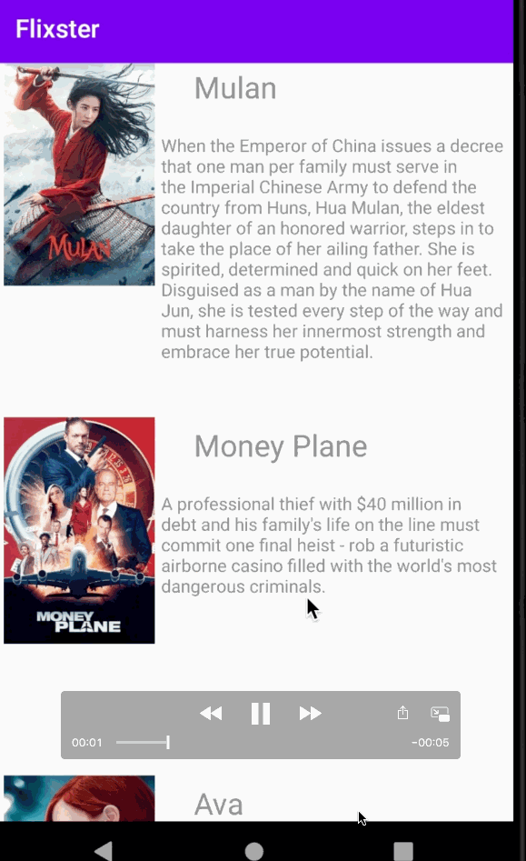

# Project-Flixter
This project lets users view a list of movies sourced from the The Movie Database API.

## Flix Part 1

### User Stories

#### REQUIRED (10pts)

- [ ] Overview: This project lets users view a list of movies sourced from the The Movie Database API.

### App Walkthough GIF

GIF created with [LiceCap](http://www.cockos.com/licecap/).

### Notes

Describe any challenges encountered while building the app.

## Open-source libraries used
- [Android Async HTTP](https://github.com/codepath/CPAsyncHttpClient) - Simple asynchronous HTTP requests with JSON parsing
- [Glide](https://github.com/bumptech/glide) - Image loading and caching library for Android
